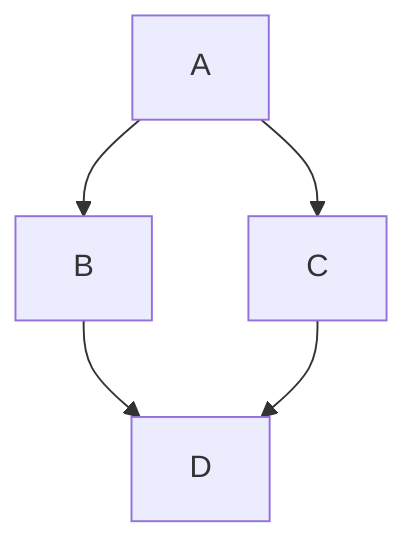
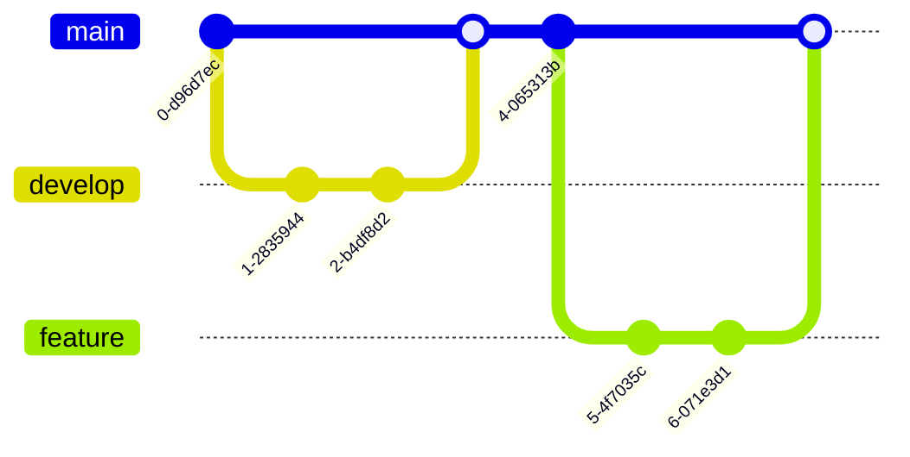

# Markdown Cheat Sheet

Thanks for visiting [The Markdown Guide](https://www.markdownguide.org)!

This Markdown cheat sheet provides a quick overview of all the Markdown syntax elements. It can’t cover every edge case, so if you need more information about any of these elements, refer to the reference guides for [basic syntax](https://www.markdownguide.org/basic-syntax/) and [extended syntax](https://www.markdownguide.org/extended-syntax/).

## Basic Syntax

These are the elements outlined in John Gruber’s original design document. All Markdown applications support these elements.

### Heading

# H1
## H2
### H3

### Bold

**bold text**

### Italic

*italicized text*

### Blockquote 
> blockquote

### Ordered List

1. First item
2. Second item
3. Third item
   1. Cocos
   2. Reten
      1. supermercado
      2. caca
4. Caca
   1. Codigo

### Unordered List

- First item
  - Second item
- Third item
- 1983 was the best year
    La Emi hace caca
- Seguro que si

### Code

In line `code`.

```python
i = i + 1
for i in range(5):
    i = 3
```

### Horizontal Rule

---

### Link

[Markdown Guide](https://www.markdownguide.org)
[Markdown Guide](https://www.markdownguide.org "hola perro dig this tooltip comment")

Llevame a la sección de [blockquote](#blockquote)

### Image


## Extended Syntax

These elements extend the basic syntax by adding additional features. Not all Markdown applications support these elements.

### Table

| Syntax | Description |
| ------------ | ----------- |
| Header | Title |
| Paragraph | Text |

### Fenced Code Block

```python
{
  "firstName": "John",
  "lastName": "Smith",
  "age": 25
}
```

### Footnote

Here's a sentence with a footnote. [^1]

[^1]: This is the footnote.

### Heading ID

### My Great Heading {#custom-id}

### Definition List

term
: definition

### Strikethrough

~~The world is flat.~~

### Task List

- [x] Write the *press* release
- [x] Update the website
- [ ] Contact the media

### Emoji

That is so **funny!**  :joy:

(See also [Copying and Pasting Emoji](https://www.markdownguide.org/extended-syntax/#copying-and-pasting-emoji))

### Highlight

I need to highlight these ==very important words==.

### Subscript

H~2~O  

### Superscript

X^2^


## Mermaid diagrams

```mermaid
architecture-beta
    service user(mdi:account)
    service lambda(logos:aws-lambda)

    user:R --> L:lambda
```







