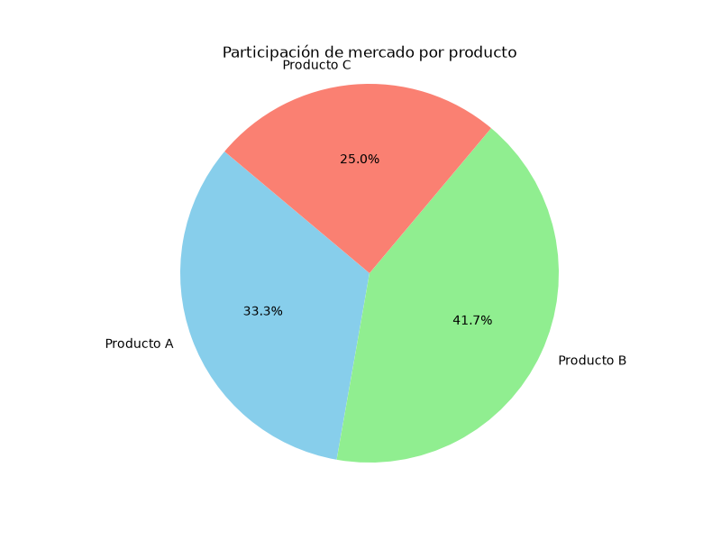
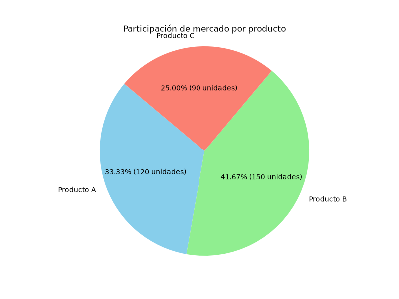
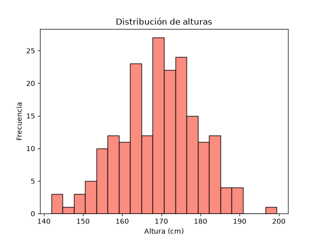
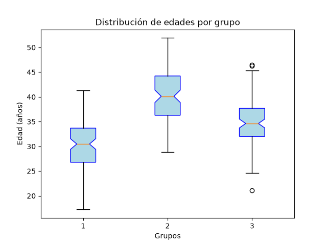
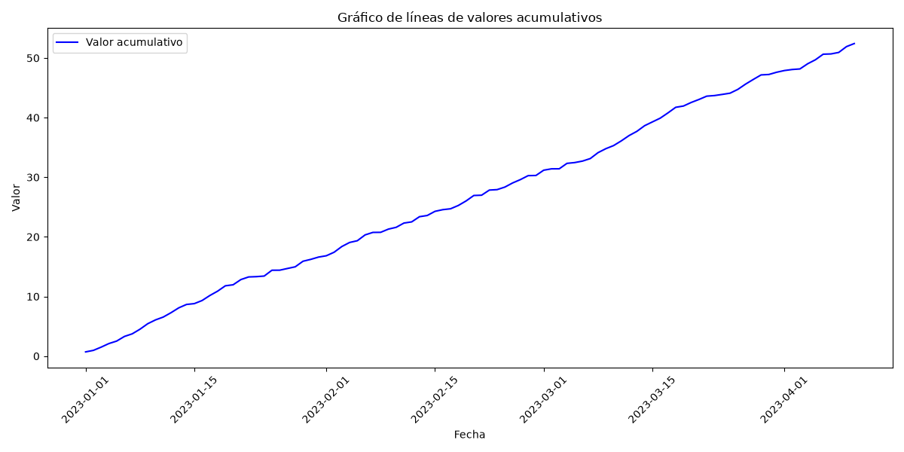

## Configuración inicial de librerías
```python
# install library the traditional way
pip install numpy matplotlib
# install libraries to the current python interpreter
python -m pip install numpy matplotlib

import numpy as np
import matplotlib.pyplot as plt
```

## gráfico de lineas (plot)

```python
month = np.array(['E', 'F', 'M', 'A', 'Ma'])
sales = np.array([20,25,30,28,35])

# configurar tamaño del gráfico
plt.figure(figsize=(8,6))
# crear el gráfico
plt.plot(month, sales, marker='o', color='blue')

plt.title('Ventas mensuales de un producto')
plt.xlabel('Meses')
plt.ylabel('Ventas en miles de unidades')

plt.show()
```


## grafico de dispersión (scatter)

```python
import matplotlib.pyplot as plt
# configurar tamaño del gráfico
plt.figure(figsize=(8,6))

hours = [2,3,4,5,6,7,8]
exam = [55,60,65,70,75,80,85]

plt.scatter(hours, exam, color='green')

plt.title('Relación entre horas estudiadas y puntaje')
plt.xlabel('Horas')
plt.ylabel('Puntaje')

plt.show()
```


## Gráfico personalizado

```python
import matplotlib.pyplot as plt

# configurar tamaño del gráfico
plt.figure(figsize=(8,6))

hours = [2,3,4,5,6,7,8]
exam_scores_student_1 = [55,60,65,70,75,80,85]
exam_scores_student_2 = [50,58,63,69,74,78,83]

# Crear gráfico de dispersión de dos estudiantes
plt.plot(hours, exam_scores_student_1, marker = 'o', color='green', linestyle='-', linewidth=2, label = 'Estudiante 1')
plt.plot(hours, exam_scores_student_2, marker = 's', color='red', linestyle='--', linewidth=2, label = 'Estudiante 2')

plt.title('Relación entre horas estudiadas y puntaje de dos estudiantes')
plt.xlabel('Horas')
plt.ylabel('Puntaje')

plt.legend(loc='upper left', fontsize=10, frameon=True)
# loc= Posición de la leyenda ('best', 'upper right', 'lower left', etc.)
# frameon= Mostrar o no el marco de la leyenda (True o False).

plt.show()
```


## Gráfico de barras
### Gráfico de barras verticales

```python
import matplotlib.pyplot as plt
plt.figure(figsize=(8,6))

categories = ['Producto A', 'Producto B', 'Producto C']
sales = [120, 150, 90]

# creación del gráfico de barras verticales
plt.bar(categories, sales, color='skyblue', label='Ventas mensuales')

# anotación con flecha para destacar un punto específico
plt.annotate('Punto destacado', xy=('Producto B', 150), xytext=('Producto C', 160),
             arrowprops=dict(facecolor='black', shrink=0.05))

plt.title('Ventas de productos en un mes')
plt.xlabel('Productos')
plt.ylabel('Ventas')
plt.legend()
plt.show()
```


### Grafico de barras horizontales

```python
import matplotlib.pyplot as plt
plt.figure(figsize=(8,6))

categories = ['Producto A', 'Producto B', 'Producto C']
sales = [120, 150, 90]

# creación del gráfico de barras verticales
plt.barh(categories, sales, color='skyblue', label='Ventas mensuales')

plt.title('Ventas de productos en un mes')
plt.xlabel('Ventas')
plt.ylabel('Productos')
# plt.legend()
plt.show()
```


## Gráfico de pastel

### Etiquetas con formato simple

```python
import matplotlib.pyplot as plt
plt.figure(figsize=(8,6))

# Datos de ejemplo: Participación de mercado por producto
categories = ['Producto A', 'Producto B', 'Producto C']
sales = [120, 150, 90]

plt.pie(sales, labels=categories, autopct='%1.1f%%', startangle=140, colors=['skyblue', 'lightgreen', 'salmon'])
plt.title('Participación de mercado por producto')

plt.axis('equal')  # Para que el gráfico sea un círculo perfecto
plt.show()
```



### Etiquetas con formato personalizado

```python

import matplotlib.pyplot as plt

def custom_autopct(pct):
    return f'{pct:.2f}% ({int(round(pct/100.*sum(sales)))} unidades)'

plt.figure(figsize=(8,6))

# Datos de ejemplo: Participación de mercado por producto
categories = ['Producto A', 'Producto B', 'Producto C']
sales = [120, 150, 90]
plt.pie(sales, labels=categories, autopct=custom_autopct, startangle=140, colors=['skyblue', 'lightgreen', 'salmon'])
plt.title('Participación de mercado por producto')

plt.axis('equal')  # Para que el gráfico sea un círculo perfecto
plt.show()
```


## Histograma

```python
import numpy as np
import matplotlib.pyplot as plt

data = np.random.normal(170, 10, 200)
# plt.hist(data, bins=30, color='salmon', edgecolor='black')
plt.hist(data, color='salmon', edgecolor='black', alpha=0.9, bins=20)
# alpha = transparencia del color, 0.0 (totalmente transparente) a 1.0 (totalmente opaco)
# bins = número de barras en el histograma, si no se especifica, matplotlib lo calcula automáticamente

plt.title('Distribución de alturas')
plt.xlabel('Altura (cm)')
plt.ylabel('Frecuencia')
plt.show()
```



## Boxplot (Diagrama de caja y bigotes)

```python
import numpy as np
import matplotlib.pyplot as plt

np.random.seed(0)  # Para reproducibilidad de los resultados

ages = [np.random.normal(30, 5, 100),
        np.random.normal(40, 5, 100),
        np.random.normal(35, 5, 100)]

plt.boxplot(ages, patch_artist=True, label=['Grupo 1', 'Grupo 2', 'Grupo 3'],
            boxprops=dict(facecolor='lightblue', color='blue'), notch=True,
            vert=True)

plt.title('Distribución de edades por grupo')
plt.ylabel('Edad (años)')
plt.xlabel('Grupos')
plt.show()
```



## Gráfico de series de tiempo con pandas y matplotlib

```python
import numpy as np
import matplotlib.pyplot as plt
import pandas as pd
from matplotlib.dates import DateFormatter

dates = pd.date_range(start= '2023-01-01', periods=100)

values = np.random.rand(100).cumsum()  # Valores aleatorios acumulativos

data = pd.DataFrame({'Fecha': dates, 'Valor': values})

# crear grafico de líneas
fig, ax = plt.subplots(figsize=(12, 6))

ax.plot(data['Fecha'], data['Valor'], color='blue', label='Valor acumulativo')
ax.set_title('Gráfico de líneas de valores acumulativos')
ax.set_xlabel('Fecha')
ax.set_ylabel('Valor')
ax.legend()
plt.xticks(rotation=45)
plt.tight_layout()
plt.show()
```

